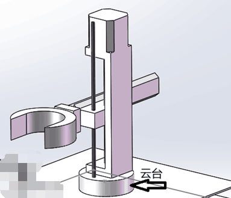
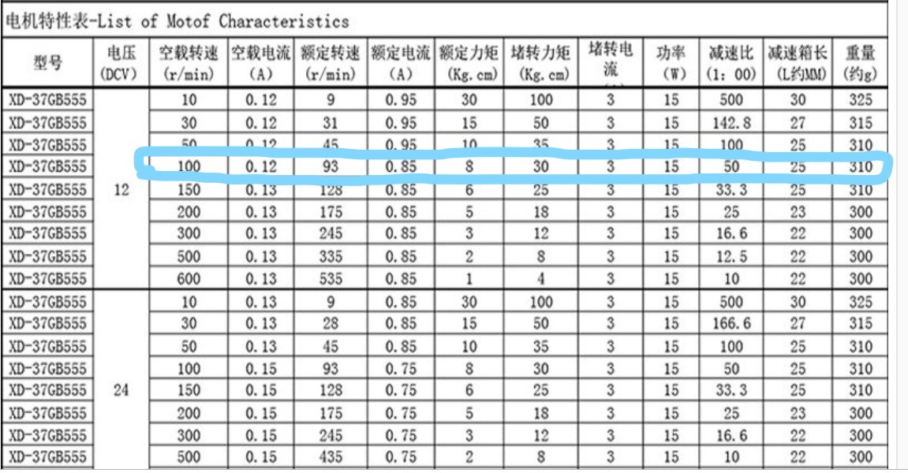
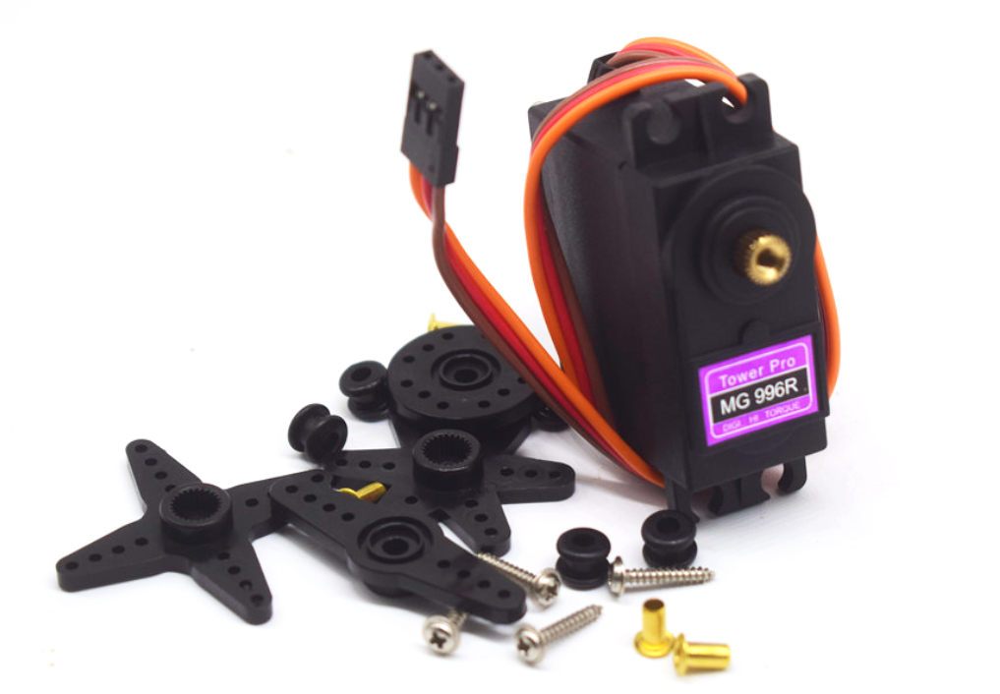
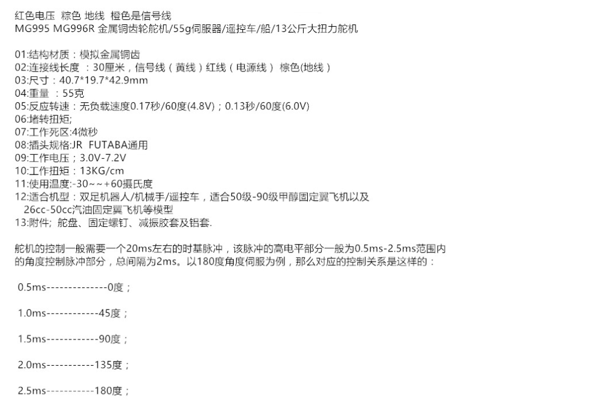
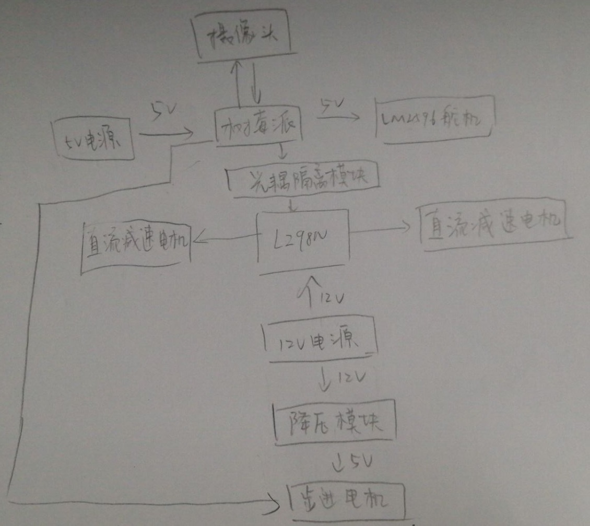
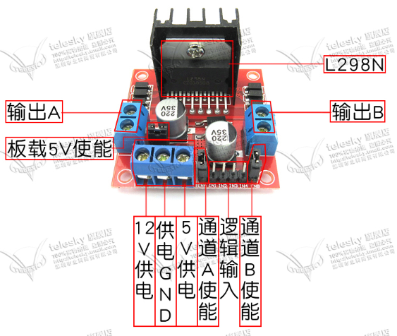
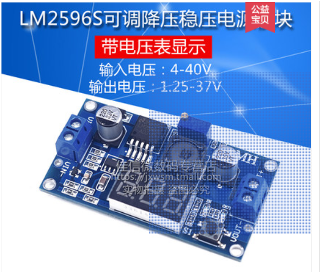

 中控杯超市赛方案初稿 

# 一、方案总述

## （1）机器人功能设计

&emsp;&emsp;本机器人准备利用树莓派实现图像识别并向机械部分下达指令，即同时充当上位机、下位机的角色。机器人的底盘采用履带，机械臂采用丝杆+云台+抓手的方案。同时，摄像头将被安装在云台上，抓手上会安装超声测距传感器，来判断某一货架是否为空。定位方面，我们采用码盘积分得到距离的方法，并用红外巡线传感器作为辅助，来起到校准和精确定位的作用。路线设计上，我们准备一次只拿一个物体。

**配图**

上半部分

下半部分（只采用它们的履带底盘）

## （2）取胜思路和可行性分析

1. 提高识别算法精确度，争取做到99%的准确度。

2. 我们不准备使用储存结构设计，避免放下后再拿起的麻烦。

3. 在实现了一个机械臂的抓取后，可能会考虑多机械臂设计。这样一次可抓取多个物体。

4. 由于采用了履带设计，故打滑的可能性较小。因而码盘+红外巡线的方案鲁棒性应当较强。

5. 后期调试时，会尽量调试到完美转弯。

# 二、机械结构设计

## （1）主要机构装配图和功能简介

&emsp;&emsp;

**配图**

## （2）传感器位置排布和电路板安装位置示意图

&emsp;&emsp;码盘安装在底盘上的两个电机上。红外巡线传感器安装在底盘下方，尽量靠近地面。摄像头安装在云台的立柱上，可以随云台转动而转动。超声距离传感器安装在抓手上。树莓派和L298N安装在底盘的两块亚克力板之间。电池安装在下面那块亚克力板之下。

**配图**

## （3）电机选型和简要选型论证

### 直流减速电机

https://m.tb.cn/h.3JxVc16

履带的圆的半径为3.25cm，中间部分的长为12.84cm取摩擦系数μ=0.1，机器人质量m=5kg。则：每个电机所需扭矩为：M=mg*μ*R=5*9.8*0.1*3.25/2=7.97N·cm

设Vmax=35cm/s,则Nmax=35*60/46.10=45.6r/min

### 步进电机

<https://m.tb.cn/h.3J4OJVh>

选型依据：步进电机主要用于控制丝杆运动，此型号步进电机能够达到转矩要求。由于丝杆的运动较慢，步进电机实际工作能达到极限转速 也在考虑范围内。

### 步进驱动器

<https://m.tb.cn/h.3J4OJVh>

和步进电机配套

### 舵机

<http://h5ip.cn/BrTz>

# 三、电路设计

## （1）电路功能描述

## （2）主控芯片选型

&emsp;&emsp;本机器人采用的主控芯片为树莓派。

> &emsp;&emsp;树莓派是微型卡片式电脑，体积只有银行卡大小，可以运行Linux系统和windows IOT系统，然后可以运行这些系统之上的应用程序，可以应用于嵌入式和物联网领域，也可以作为小型的服务器，完成一些特定的功能。
>
> &emsp;&emsp;与嵌入式微控制器（常见的51单片机和STM32）相比，除了可以完成相同的IO引脚控制之外，因为运行有相应的操作系统，可以完成更复杂的任务管理与调度，能够支持更上层应用的开发，为了开发者提供了更广阔的应用空间。比如开发语言的选择不仅仅只限于C语言，连接底层硬件与上层应用，可以实现物联网的云控制和云管理，也可以忽略树莓派的IO控制，使用树莓派搭建小型的网络服务器，做一些小型的测试开发和服务。
>
> &emsp;&emsp;与通用的PC平台相比，树莓派提供的IO引脚可以直接控制其他底层硬件，这是通用PC做不到的，同时它的体积更小，成本很小，同样可以完成一些PC任务与应用。

> 3B+型树莓派参数
>
> CPU：ARM Cortex-A53 CPU
>
> 内存：1GB

## （3）传感器选型

1. 四路红外循迹模块 https://detail.tmall.com/item.htm?spm=a230r.1.14.6.2ad31b9cbQsZeR&id=21073732939&cm_id=140105335569ed55e27b&abbucket=8
2. 光耦隔离模块 https://item.taobao.com/item.htm?spm=a230r.1.14.40.5bda5915XkoTrp&id=534380115516&ns=1&abbucket=8#detail
3. L298N <https://detail.tmall.com/item.htm?spm=a220m.1000858.1000725.1.2e3ad1a1i2zEws&id=39861302105&user_id=2081278226&cat_id=2&is_b=1&rn=ff8e2311ef398e3d213531b5c3cdb08d>
4. 超声距离传感器 https://detail.tmall.com/item.htm?spm=a230r.1.14.6.dd66528dApceBm&id=40102506092&cm_id=140105335569ed55e27b&abbucket=8
5. 树莓派专用摄像头 https://detail.tmall.com/item.htm?spm=a230r.1.14.15.3bcf48b8alhaZy&id=42669533275&ns=1&abbucket=8

## （4）电路原理图

### 光耦隔离模块

http://h5ip.cn/fdjI

光耦的主要作用就是隔离作用，隔离能起到保护作用，一边是控制电路，一边是电机驱动电路，光耦将他们隔开

### 直流电机驱动板块

### 降压模块

# 四、算法设计

## （1）算法功能描述

&emsp;&emsp;图像识别部分：通过对在定点处拍摄的照片进行图像识别与物体定位，并向机械部分传达是否抓取的指令。

&emsp;&emsp;下位机部分：实现按物品抓取、一物一抓一放、放置时检测是否为空，后期可能会加入最短路线规划

## （2）算法实现

&emsp;&emsp;图像识别：识别物体采用深度学习方法，准备使用Tensorflow，并且采用训练好的开源方案进行微调，使用云服务器（TinyMind）进行训练，实时运行在树莓派上。如果实时效果不好，可能会采用加装Intel神经元计算棒的方案，或者改用笔记本电脑。

&emsp;&emsp;路线规划：预先在程序中存入场地的相关信息，为了方便，只走与场上的线平行或垂直的路线，转弯也只转直角。

&emsp;&emsp;下位机部分：直接使用树莓派对机械部分进行控制。具体的控制指令由上位机发出，下位机程序不做大量运算。

# 五、尚未解决的难点问题

&emsp;&emsp;各部分的想法刚刚形成，具体细节有待商榷。

&emsp;&emsp;另外，多机械臂方案不清楚可行性。机器学习的效果目前未知。而且树莓派的算力还不是很能保证。

# 六、经费预算和进度安排

&emsp;&emsp;

|       物品       | 价格  |
| :--------------: | :---: |
|    树莓派 3b+    |  217  |
|      摄像头      |  109  |
|  超声距离传感器  | 4.15  |
| 四路红外循迹模块 | 9.22  |
|      L298N       |  8.8  |
|   光耦隔离模块   |  7.6  |
|       云台       |       |
|       丝杆       |  46   |
|     机械抓手     | 36.42 |
|       电机       |       |
|   其他机械结构   |  100  |
|     **总计**     |       |

|   **寒假**    | **图像识别调教完毕、零件采购基本完成、基本机械框架组装、90°转弯** |
| :-----------: | :----------------------------------------------------------: |
| **3月开学后** |        **实现机械抓手抓取，上位机下位机程序结合测试**        |
|   **3.24**    |                   **二审：机器人基本功能**                   |
|   **4月初**   |                   **提高鲁棒性，优化路线**                   |
|   **4.14**    |                   **三审：机器人进阶功能**                   |
|  **4月下旬**  |                      **考虑多抓手方案**                      |
|    **5.5**    |                          **资格赛**                          |
|   **5.19**    |                           **校赛**                           |

